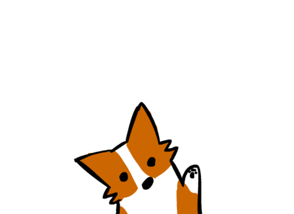

# README 

El la siguiente página se trata de un pequeño **proyecto** desarrollado
para el módulo de  ~~Contornos de Desenvolvemento~~ _Linguaxes de Marca_.

## El proyecto se evalúa del siguiente modo:

| Elementos      | IMPORTANCIA   |
| -------------- |:-------------:|
| estructura     | Alta          |
| uso de recursos| Alta          |
| responsividad  | Media         |
| estética       | Baja          |

Así que en la página he incluido:

1. HTML
    * Estructura Header, Footer, Aside, etc.
    * Listas
    * Tablas
    * Formularios
2. CSS
    * Responsividad
    * Flex
    * Diseño moderno

Puedes ver la página en https://csrgrr.github.io

>Que la suerte te pille trabajando.  — Pablo Picasso.

<h3>No olvides:</h3>

<ul>
    <li>Contactarme en @csrgrr</li>
    <li>Darme Feedback</li>
    <li>Ser respetuoso</li>
</ul>
<em> hasta la próxima...</em>

echo "# Hello World"

